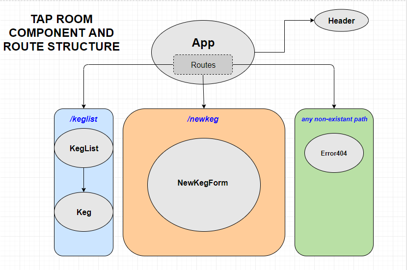

# Meme Generator

## Epicodus Javascript level 3 group 

#### Project August 30, 2018

#### By Will Swanson, Matt Smith, Thad Donaghue, and Craig Wann

This project was generated with [Angular CLI](https://github.com/angular/angular-cli) version 1.6.5.

## Description

Spend any amount of time on the internet and you're quite likely to encounter [memes](https://en.wikipedia.org/wiki/Meme).  The four of us decided to take the established template of running text over an image and giving a user the option to randomize the results and see what entertaining results may happen.  **Please note that while we've taken steps to limit offensive content, this program draws from a number of random sources and the juxtaposed imagery, phrases and attributed speaker of said content may inadvertently yield offensive results**.

## Specifications

Clicking the `Generate Meme` button on the default `English` setting will cycle through a variety of random images for display as well as overlaying a phrase and attribute that phrase to a notable speaker.  The Quotes are taken in in batches of 100.  Any quotes found to be longer than 100 characters are filtered out and the remainders are stored and used for subsequent clicks so as not to needlessly tax the quote API.

The `Randomized English` applies an additional level of abstraction by randomly comparing nouns, verbs and adjectives in the fetched quote with arrays of similar types of words.  At that point, words are randomly replaced with different words of the same type.

`Japanese`, `Russian`, `Greek` and `Telugu` all present a phrase in the selected language.  Initially we had planned to pass the phrase through a translator API, but each service that we found was prohibitively expensive for our uses.

The `SpEcIaL` feature was initially a solution to fetched quotes that exceeded 100 characters.  The phrase is parsed and truncated after the last full word and the remainder of the sentence is addended with a random ridiculous word or phrase.  We subsequently programmed more elegant ways to avoid text overflowing the background image, but we wanted to keep this functionality as an easter egg.

As an added feature, the page title changes to a new silly phrase with every click.

## Setup Instructions

* Install Node.js.
* Install Angular CLI 1.6.5.
* Clone the project repo.
* Run `npm install` from project directory.
* Run `ng serve --open` for a dev server.  It should bring up the page automatically, but navigate to `http://localhost:4200/` if it does not. The app will automatically reload if you change any of the source files.

## Technologies Used

* HTML5/CSS3
* Bootstrap
* ES6
* Typescipt
* Node.js
* Angular v5.2.0
* TSLint

## Links

* [Github Repo](https://github.com/wvw999/meme)
* [Firebase](https://meme-afecf.firebaseapp.com/)

## License

This software is licensed under the MIT license.

Copyright (c) 2018 **Thad Donaghue, Will Swanson, Matt Smith and Craig Wann**
